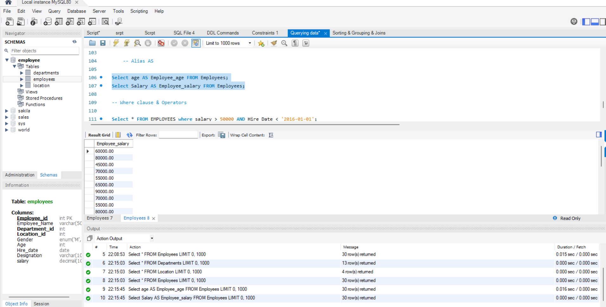
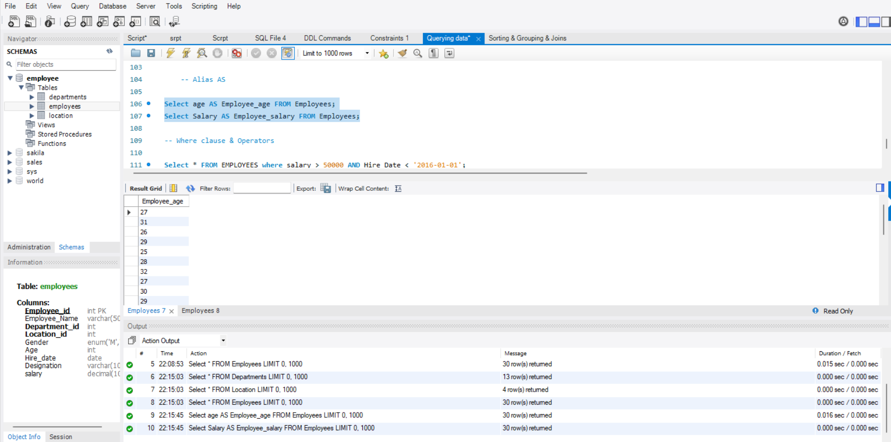

🗄️ Employee Database – MySQL SQL Practice
📌 Project Overview

This project focuses on SQL and MySQL database querying using an Employee Management database.

The database consists of three related tables — Employees, Departments, and Location — and is designed to practice fundamental and intermediate SQL concepts such as data retrieval, filtering, sorting, grouping, aggregate functions, HAVING, and different types of JOIN.

The assignment is divided into two major topics:

🔎 Querying Data
📊 Sorting & Grouping Data and Joins

Through these exercises, the project demonstrates how SQL can be used to retrieve meaningful information, summarize data, analyze employee records, and combine information from multiple relational tables.

🎯 Objectives

The main objectives of this assignment are to:

Create a relational database using MySQL
Create tables with appropriate constraints
Insert and manage employee-related data
Retrieve records using SELECT
Filter records using WHERE
Use comparison and logical operators
Identify missing values using IS NULL
Update existing records using UPDATE
Sort data using ORDER BY
Limit query results using LIMIT and OFFSET
Use aggregate functions such as SUM(), MIN(), MAX(), AVG(), and COUNT()
Group data using GROUP BY
Filter grouped data using HAVING
Combine multiple tables using INNER JOIN, LEFT JOIN, and RIGHT JOIN
Perform practical employee and organizational data analysis

🗂️ Database Information

Database Name
CREATE DATABASE Employee;
USE Employee;
Tables Used
Table	Purpose
Employees	Stores employee information
Departments	Stores department information
Location	Stores location information
Database Relationship
Departments
     │
     │ Department_id
     ▼
Employees
     │
     │ Location_id
     ▼
Location

The Employees table acts as the central table and is connected to both the Departments and Location tables through foreign keys.

🏢 1. Departments Table

The Departments table stores information about the organization's departments.

Structure
Column	Data Type	Constraint
Department_id	INT	Primary Key, Unique
Department_Name	VARCHAR(100)	Unique, Not Null
Departments Included
Software Development
Marketing
Data Science
Human Resources
Product Management
Content Creation
Finance
Design
Research and Development
Customer Support
Business Development
IT
Operations
📍 2. Location Table

The Location table stores the locations where employees are assigned.

Structure
Column	Data Type	Constraint
Location_id	INT	Primary Key, Auto Increment
Location_name	VARCHAR(100)	Unique, Not Null
Locations Included
Chennai
Bangalore
Hyderabad
Pune
👨‍💼 3. Employees Table

The Employees table contains employee-related information.

Structure
Column	Data Type	Description
Employee_id	INT	Unique employee identifier
Employee_Name	VARCHAR(50)	Employee name
Department_id	INT	Department reference
Location_id	INT	Location reference
Gender	ENUM	M/F
Age	INT	Employee age
Hire_date	DATE	Employee joining date
Designation	VARCHAR(100)	Job designation
Salary	DECIMAL(10,2)	Employee salary
🔐 Database Constraints Used

The database uses several SQL constraints to maintain data integrity.

Primary Key
Employee_id INT PRIMARY KEY

Uniquely identifies each employee.

Foreign Key
FOREIGN KEY(department_id)
REFERENCES Departments(department_id)
FOREIGN KEY(location_id)
REFERENCES Location(location_id)

Establishes relationships between the tables.

UNIQUE

Prevents duplicate department and location names.

NOT NULL

Ensures required fields contain values.

CHECK
Age INT CHECK(Age >= 18)

Ensures that employees are at least 18 years old.

DEFAULT
Hire_date DATE DEFAULT(CURRENT_DATE)

Automatically assigns the current date when a hire date is not provided.

🔎 PART 1 – QUERYING DATA
1. SELECT Statement

The SELECT statement is used to retrieve data from tables.

SELECT *
FROM Employees;

Other tables can also be queried:

SELECT *
FROM Departments;
SELECT *
FROM Location;

2. DISTINCT

DISTINCT is used to retrieve only unique values.

Example – Unique Salaries
SELECT DISTINCT Salary
FROM Employees;

This eliminates duplicate salary values from the result.

3. Column Alias Using AS

The AS keyword provides a temporary alternate name for a column.

Employee Age
SELECT Age AS Employee_age
FROM Employees;
Employee Salary
SELECT Salary AS Employee_salary
FROM Employees;

Aliases make query results easier to understand.

🔍 4. WHERE Clause

The WHERE clause filters records according to specified conditions.

Example
SELECT *
FROM Employees
WHERE Salary > 50000;

This retrieves employees whose salary is greater than 50,000.

⚙️ 5. Comparison Operators

SQL comparison operators are used to compare values.

Operator	Meaning
=	Equal to
<>	Not equal to
>	Greater than
<	Less than
>=	Greater than or equal to
<=	Less than or equal to
Example
SELECT *
FROM Employees
WHERE Salary > 50000;
🔗 6. Logical Operators
AND

Returns records where both conditions are true.

SELECT *
FROM Employees
WHERE Salary > 50000
AND Hire_Date < '2016-01-01';

This query identifies employees who:

Earn more than 50,000
Were hired before January 1, 2016
OR

Returns records where at least one condition is true.

SELECT *
FROM Employees
WHERE Department_id = 3
OR Department_id = 7;
NOT

Negates a condition.

SELECT *
FROM Employees
WHERE NOT Gender = 'M';
❌ 7. IS NULL

IS NULL is used to identify missing values.

SELECT *
FROM Employees
WHERE Designation IS NULL;

In the original dataset, employee 5004 had a missing designation.

✏️ 8. UPDATE Statement

The UPDATE statement is used to modify existing records.

Updating Missing Designation
UPDATE Employees
SET Designation = 'Data Scientist'
WHERE Employee_ID = 5004;

The record can then be verified using:

SELECT *
FROM Employees;
📊 PART 2 – SORTING & GROUPING DATA
↕️ 9. ORDER BY

ORDER BY is used to sort query results.

Sort by Department and Salary
SELECT *
FROM Employees
ORDER BY Department_id ASC,
         Salary DESC;

This sorts:

Department IDs in ascending order
Salaries in descending order within each department
Sort Employees by Salary
SELECT *
FROM Employees
ORDER BY Salary DESC;

This displays employees from the highest salary to the lowest salary.

🔢 10. LIMIT and OFFSET

LIMIT restricts the number of records returned.

SELECT *
FROM Employees
LIMIT 5;

This returns the first five records.

LIMIT with OFFSET
SELECT *
FROM Employees
LIMIT 5 OFFSET 18;

This skips the first 18 records and returns the next 5 records.

🧮 11. Aggregate Functions

Aggregate functions perform calculations across multiple rows.

Function	Purpose
SUM()	Calculates total
MIN()	Finds minimum value
MAX()	Finds maximum value
AVG()	Calculates average
COUNT()	Counts records
💰 12. SUM()
Total Salary in Finance Department
SELECT D.department_name,
       SUM(E.salary) AS Total_salary
FROM Employees E
JOIN Departments D
ON E.department_id = D.Department_id
WHERE D.Department_name = 'Finance'
GROUP BY D.Department_name;

This query:

Joins Employees with Departments
Filters the Finance department
Calculates the total salary
Groups the result by department name
📉 13. MIN()
Minimum Employee Age
SELECT MIN(Age)
FROM Employees;

This identifies the youngest employee age in the dataset.

💵 14. MAX()
Maximum Salary by Location
SELECT L.Location_name,
       MAX(E.Salary) AS Maximum_salary
FROM Employees E
JOIN Location L
ON E.Location_id = L.Location_id
GROUP BY L.Location_name;

This query identifies the highest salary at each location.

📈 15. AVG()
Average Salary for Analyst Designations
SELECT Designation,
       AVG(Salary) AS Average_salary
FROM Employees
WHERE Designation LIKE '%Analyst%'
GROUP BY Designation;

The LIKE operator searches for designations containing the word Analyst.

Examples include:

Data Analyst
Marketing Analyst
Financial Analyst
Finance Analyst
Business Analyst
Supply Chain Analyst
Quality Assurance Analyst
🔢 16. COUNT() and GROUP BY
Departments with Fewer Than 3 Employees
SELECT D.Department_Name,
       COUNT(*) AS Employee_Count
FROM Employees E
JOIN Departments D
ON E.Department_id = D.Department_id
GROUP BY D.Department_name
HAVING COUNT(*) < 3
ORDER BY Employee_Count DESC;

This query:

Groups employees by department
Counts employees in each department
Filters departments having fewer than 3 employees
Sorts the result by employee count
🔎 17. GROUP BY

GROUP BY is used to group rows with the same value and is commonly used with aggregate functions.

Example
SELECT Designation,
       AVG(Salary) AS Average_salary
FROM Employees
GROUP BY Designation;

This calculates the average salary for each designation.

🎯 18. HAVING

HAVING is used to filter grouped results.

Example
SELECT D.Department_Name,
       COUNT(*) AS Employee_Count
FROM Employees E
JOIN Departments D
ON E.Department_id = D.Department_id
GROUP BY D.Department_name
HAVING COUNT(*) < 3;
WHERE vs HAVING
WHERE	HAVING
Filters individual rows	Filters groups
Applied before grouping	Applied after grouping
Commonly used for normal conditions	Commonly used with aggregate functions
👩 19. Female Employees with Average Age Below 30 by Location
SELECT L.Location_Name,
       AVG(E.Age) AS Average_Age
FROM Employees E
JOIN Location L
ON E.Location_id = L.Location_id
WHERE E.Gender = 'F'
GROUP BY L.Location_name
HAVING AVG(E.Age) < 30;

This query:

Selects female employees
Groups them by location
Calculates their average age
Displays only locations where the average age is below 30
🔗 PART 3 – JOINS

SQL JOIN operations are used to combine data from multiple related tables.

The Employee database demonstrates:

INNER JOIN
LEFT JOIN
RIGHT JOIN
🔵 20. INNER JOIN

INNER JOIN returns records where matching values exist in both tables.

Employee Names, Designations and Department Names
SELECT E.Employee_name,
       E.Designation,
       D.Department_name
FROM Employees AS E
INNER JOIN Departments D
ON E.Department_id = D.Department_id;

This combines employee information with the corresponding department information.

🟢 21. LEFT JOIN

LEFT JOIN returns all records from the left table, along with matching records from the right table.

All Departments and Employee Count
SELECT D.Department_Name,
       COUNT(E.Employee_id) AS Employee_Count
FROM Departments D
LEFT JOIN Employees E
ON D.Department_id = E.Department_id
GROUP BY D.Department_Name;

This is useful when we want to display every department, including departments that currently have no employees.

Using:

COUNT(E.Employee_id)

instead of COUNT(*) ensures departments without employees are counted as 0.

🟠 22. RIGHT JOIN

RIGHT JOIN returns all records from the right table and matching records from the left table.

Locations and Assigned Employees
SELECT L.Location_Name,
       E.Employee_Name
FROM Employees E
RIGHT JOIN Location L
ON E.Location_id = L.Location_id
ORDER BY L.Location_Name;

This displays all locations and the employees assigned to them.

If a location has no employees, the employee name will appear as NULL.

🧩 SQL Concepts Practiced
CREATE DATABASE
CREATE TABLE
INSERT INTO
SELECT
DISTINCT
AS
WHERE
AND
OR
NOT
LIKE
IS NULL
UPDATE
ORDER BY
ASC
DESC
LIMIT
OFFSET
SUM()
MIN()
MAX()
AVG()
COUNT()
GROUP BY
HAVING
INNER JOIN
LEFT JOIN
RIGHT JOIN
PRIMARY KEY
FOREIGN KEY
UNIQUE
NOT NULL
CHECK
DEFAULT
📋 Query Summary
Topic	Concepts Practiced
Database Creation	CREATE DATABASE, USE
Table Creation	CREATE TABLE
Data Insertion	INSERT INTO
Data Retrieval	SELECT
Unique Values	DISTINCT
Column Naming	AS
Filtering	WHERE
Pattern Matching	LIKE
Missing Data	IS NULL
Data Modification	UPDATE
Sorting	ORDER BY, ASC, DESC
Result Limiting	LIMIT, OFFSET
Aggregation	SUM, MIN, MAX, AVG, COUNT
Grouping	GROUP BY
Group Filtering	HAVING
Combining Tables	INNER JOIN, LEFT JOIN, RIGHT JOIN
💡 Key Learnings

Through this assignment, I gained practical experience in:

Designing a basic relational database
Creating tables with appropriate constraints
Establishing relationships using primary and foreign keys
Retrieving specific information from databases
Filtering records based on multiple conditions
Identifying and updating missing data
Sorting records using multiple columns
Limiting and controlling query results
Performing calculations using aggregate functions
Grouping data for analysis
Filtering aggregated results using HAVING
Combining information from multiple tables using different types of joins
Performing practical employee and organizational data analysis
🛠️ Technical Skills Demonstrated
MySQL
SQL
Database Management
Data Querying
Data Filtering
Data Sorting
Data Grouping
Aggregate Functions
Data Analysis
Table Joins
Relational Database Concepts
Primary & Foreign Keys
SQL Constraints
